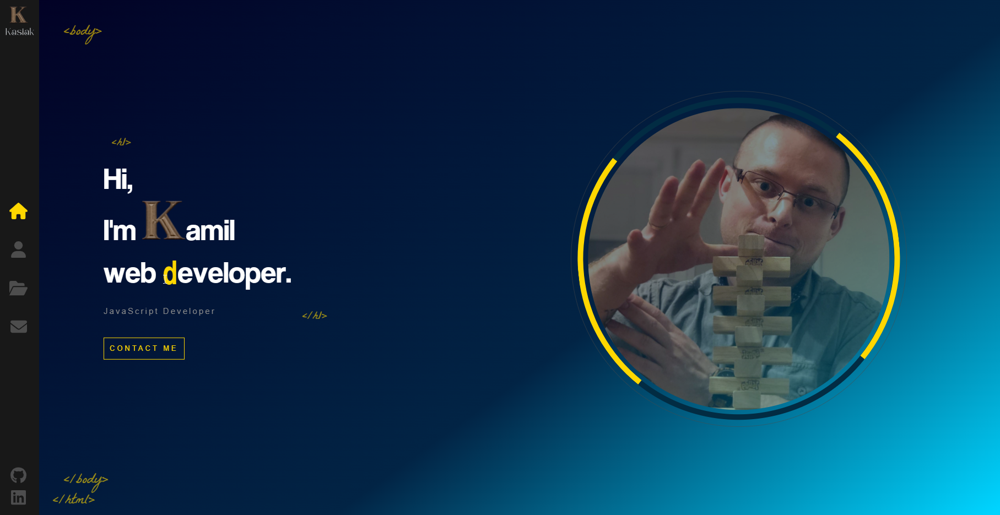
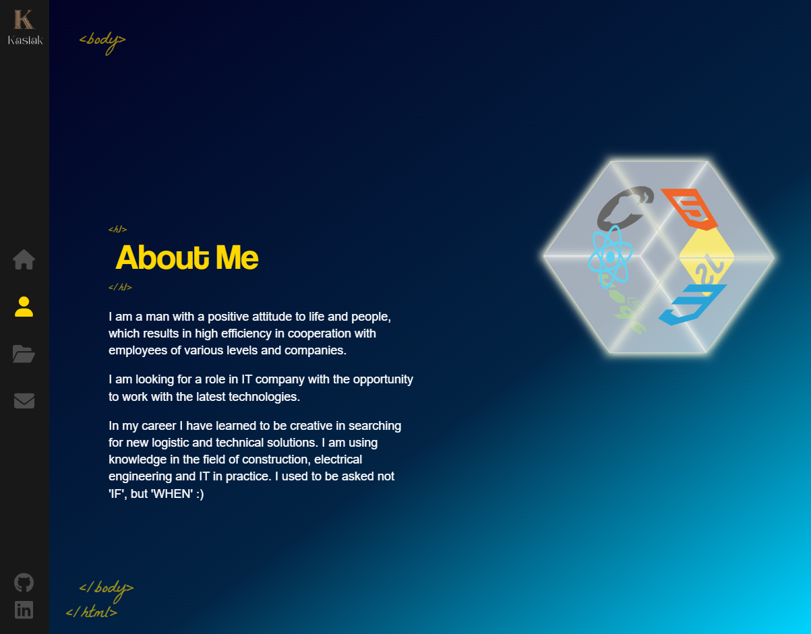
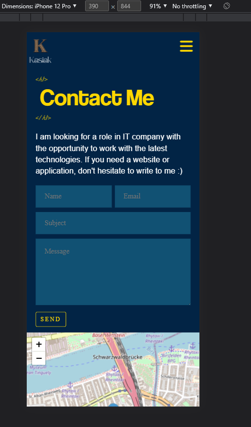

# Portfolio website
> Website created as portfolio <!-- [_here_](https://www.example.com). -->

## Table of Contents
* [General Info](#general-information)
* [Technologies Used](#technologies-used)
* [Features](#features)
* [Screenshots](#screenshots)
* [Setup](#setup)
* [Usage](#usage)
* [Project Status](#project-status)
* [Room for Improvement](#room-for-improvement)
* [Contact](#contact)
<!-- * [License](#license) -->

## General Information
- When you to show some of your work as web developer you have to have a portfolio site
<!-- - What problem does it (intend to) solve?
- What is the purpose of your project?
- Why did you undertake it? -->

## Technologies Used
- React - version 18.2.0
- Sass - version 1.54.5
- JavaScript
- SCSS
- CSS3

## Features
<!-- List the ready features here: -->
- possibility to send contact email with EmailJs
- easy navigate throught pages
- showing localization on openMap
- mobile optimization

## Screenshots

## Project Status
Project is: _in progress_ 
<!-- / _complete_ / _no longer being worked on_. If you are no longer working on it, provide reasons why. -->

## Room for Improvement
<!-- Include areas you believe need improvement / could be improved. Also add TODOs for future development. -->

Room for improvement:
- add new projects to portfolio page

## Contact
Created by [@kamilkasiak] - feel free to contact me!

